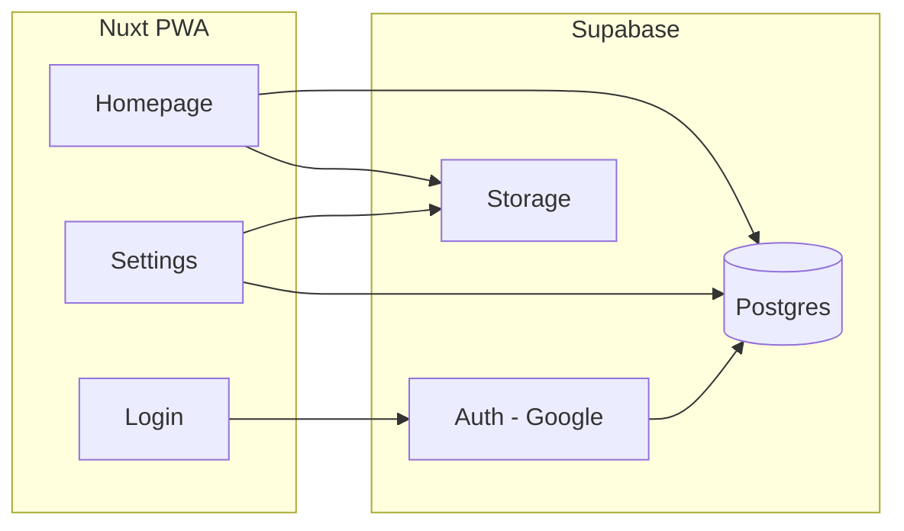

# SSAW PWA — Implementation Plan

## Scope

- **Frontend:** Nuxt 4 + PWA (no backend specified; plan assumes **Supabase** for auth, DB, and file storage so the app can ship without a custom server).
- **Partner matching:** **Strict mutual** — "Matched" only when both users have set each other as partner (each has the other's email). One user entering partner's email is "pending" until the partner also enters theirs.

---

## Architecture



- **Auth:** Supabase Auth with Google OAuth; session handled by `@nuxtjs/supabase`.
- **Data:** Postgres via Supabase: `profiles` (avatar, name, email, partner_email), `time_blocks`, `block_notes`, `comments`.
- **Files:** Supabase Storage for avatars and block images.

---

## Tech Stack (concrete)

| Layer | Choice |
|-------|--------|
| Framework | Nuxt 4 |
| PWA | `@vite-pwa/nuxt` (manifest, service worker, installability) |
| Auth + Backend | Supabase (Google OAuth, Postgres, Storage) |
| Utilities | VueUse (reactive composables for state, browser APIs, sensors, etc.) |
| Styling | Your choice (e.g. Tailwind via `@nuxtjs/tailwindcss`) |

---

## Data Model (Supabase / Postgres)

- **profiles** (extends Supabase `auth.users` via trigger): `id` (uuid), `email` (from auth, unique), `display_name`, `avatar_url`, `partner_email` (nullable). "Matched" = `profiles.partner_email` is set and the row for that partner has `partner_email = this user's email`.
- **time_blocks:** `id`, `user_id`, `day` (date), `start_time`, `end_time`, `created_at`.
- **block_notes:** `id`, `time_block_id`, `content` (text), `created_at`; 1:1 or 1:many per block (your choice; 1:1 is enough for "add notes to this block").
- **block_note_attachments:** `id`, `block_note_id`, `file_path` (Supabase Storage) for images.
- **comments:** `id`, `block_note_id`, `user_id`, `body`, `created_at` (for commenting on partner's notes).

RLS policies: users can read/write own profile and own time blocks/notes; can read partner's blocks/notes and write comments on them.

---

## Pages and Flows

### 1. Login (`/login`)

- Single action: "Sign in with Google" → Supabase `signInWithOAuth({ provider: 'google' })`.
- After callback, redirect to `/` (homepage). Middleware will send users without a session to `/login`.

### 2. Homepage (`/`)

- **Guard:** If not logged in → redirect to `/login`.
- **Partner prompt:** If logged in and `partner_email` is null/empty → show modal: "Enter partner's email" with input + "Skip" (close and go to timeline) and "Match" (save email and close). Skip allows matching later in Settings.
- **Day navigation:** At top, "Previous day" / "Next day" (or a small date picker) and a clear "Today" label. Store current day in query or component state.
- **Timeline(s):**
  - **Unmatched:** One vertical timeline for the current user for the selected day (e.g. 00:00–24:00, 30-min or 1-hour rows).
  - **Matched:** Two vertical timelines side-by-side (or stacked on narrow screens): "You" and "Partner" for the same day.
- **Your timeline interaction:**
  - **Create block:** Mousedown on your timeline → drag to set range → mouseup → open "New time block" modal: time range (prefilled), notes (plain text), image upload(s). Submit → insert `time_blocks` + `block_notes` (+ attachments to Storage).
  - **Edit/delete:** Optional: click your own block to edit notes or delete (can be Phase 2).
- **Partner's timeline interaction:** Click partner's block → open "View notes" modal (read-only notes + images). In that modal, a "Comments" section: list comments and an input to add a comment → insert into `comments` table.

### 3. Settings (`/settings`)

- **Avatar:** Upload image → Supabase Storage → update `profiles.avatar_url`.
- **Name:** Text input → update `profiles.display_name`.
- **Match:** Section "Partner" with input for email + "Save" (same as partner modal: set `partner_email`). Show current partner email if set; option to clear/unmatch.

---

## File Structure (Nuxt 4)

Nuxt 4 uses the default `app/` directory; this plan follows that structure.

- `app.vue` — layout shell (optional; or use `app/layouts/default.vue` with nav).
- `app/layouts/default.vue` — header (day nav on homepage, link to Settings) + `<NuxtPage />`.
- `app/pages/login.vue` — Google sign-in button.
- `app/pages/index.vue` — homepage: day picker, partner modal (when no partner), one or two timeline components.
- `app/pages/settings.vue` — avatar, name, partner email form.
- `app/components/` — e.g. `PartnerMatchModal.vue`, `DayNav.vue`, `Timeline.vue` (reusable for "you" and "partner"), `TimeBlock.vue`, `BlockNoteModal.vue` (create/edit your block), `PartnerBlockModal.vue` (view partner notes + comments), `CommentList.vue`.
- `app/composables/useAuth.ts` or use `useSupabaseUser`; `app/composables/usePartner.ts` — fetch partner profile when matched; consider `shared/` for types used by app + server.
- `app/middleware/auth.ts` — redirect unauthenticated users to `/login` (apply to `/` and `/settings`).
- Supabase: set up project, Google provider, tables above, RLS and Storage bucket; env: `SUPABASE_URL`, `SUPABASE_KEY` (public key in `.env`).

---

## Timeline UX (homepage)

- **Grid:** Vertical axis = time (e.g. 0–24h); one column for "you," one for "partner" when matched. Blocks rendered as positioned divs (or absolute) by `start_time`/`end_time`.
- **Drag to create:** On "your" column only: `mousedown` → record start pixel/time → `mousemove` → show preview range → `mouseup` → convert to `start_time`/`end_time` and open Block Note modal. Use a single timeline component that accepts a prop `mode: 'own' | 'partner'` to switch behavior (drag vs click-to-view).

---

## PWA Configuration

- Add `@vite-pwa/nuxt`; in `nuxt.config.ts` set `manifest.name` / `short_name` to "SSAW", `theme_color`, and icons (192/512). Use `registerType: 'autoUpdate'` so updates apply without manual refresh.

---

## Implementation Order

1. **Scaffold:** Nuxt 4 app (`npx nuxi@latest init` or `nuxt upgrade` if migrating), Supabase module, env, Tailwind (or chosen CSS). Prefer Nuxt 4 default structure (e.g. `app/`).
2. **Auth:** Google OAuth in Supabase, login page, auth middleware.
3. **DB and RLS:** Create `profiles` (and trigger from `auth.users`), `time_blocks`, `block_notes`, `block_note_attachments`, `comments`; RLS as above.
4. **Profile and matching:** Settings page (avatar, name, partner email); PartnerMatchModal on homepage when no partner; composable to resolve "partner" profile when matched.
5. **Homepage shell:** Day navigation, single timeline for "you" with mock or real blocks.
6. **Your timeline:** Drag-to-create block, Block Note modal (text + images), persist to DB and Storage.
7. **Partner timeline:** Second timeline when matched; click partner block → view notes + comments (read + write).
8. **PWA:** Add and configure `@vite-pwa/nuxt`, manifest and icons.
9. **AI agents:** Run `npx add-skill onmax/nuxt-skills`, `npx add-skill supabase/agent-skills`, and `npx add-skill vueuse/skills` (when scaffolding or early in implementation). Optionally add a small SSAW-specific rule for product conventions.

---

## Open Decisions

- **Backend:** If you prefer not to use Supabase, the same UX can be implemented with Firebase (Auth + Firestore + Storage) or a custom API; the page and component structure stays the same.

---

## AI Agents — Agent Skills

Use the **Agent Skills** standard (skills installed into `.cursor/skills/` or `~/.cursor/skills/`) so AI agents have Nuxt, Supabase, and VueUse context. Install via the add-skill CLI:

```bash
npx add-skill onmax/nuxt-skills
npx add-skill supabase/agent-skills
npx add-skill vueuse/skills
```

**Packages:**

1. **onmax/nuxt-skills** — Nuxt 4+ and Vue 3 guidance: server routes, file-based routing, middleware, composables, auto-imports. Includes a `vueuse` skill for VueUse composables. Optionally install specific skills, e.g. `--skill nuxt --skill vue`.

2. **supabase/agent-skills** — Supabase/Postgres best practices: `supabase-postgres-best-practices` (queries, schema, RLS). Use when writing or reviewing DB code.

3. **vueuse/skills** — **vueuse-functions**: apply VueUse composables for reactive state, browser APIs, sensors, animations; prefer VueUse before writing custom composables.

**Implementation:** When scaffolding the repo, run the three `npx add-skill` commands above (project-scoped by default). Optionally add a small project rule (e.g. `.cursor/rules/ssaw.mdc`) that describes SSAW conventions (strict mutual matching by email, timeline UX) so agents stay aligned with product behavior.
